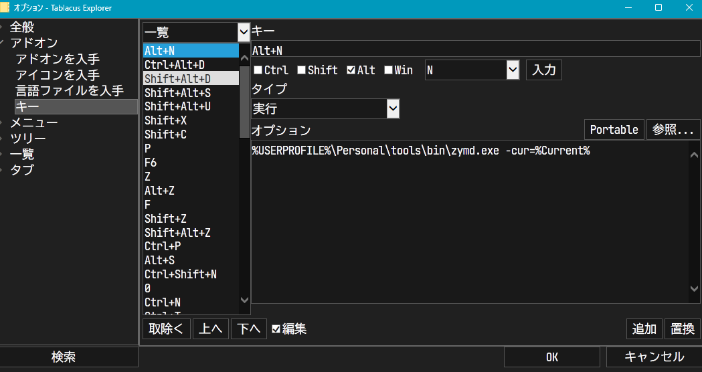

# README

Command line tool for [Tablacus Explorer](https://tablacus.github.io/explorer.html).

- Show fuzzy-finder with and create directory with selected name.
- Possible directory names:
    - `plain`
    - `proofed`
    - `send_to_author`
    - `proofed_by_author`
    - `send_to_printshop`
- If a directory with an index number (i.e., the name of the directory begins with a number; `0_plain`, `1_proofed` ...) exists in working directory, increment the index and add it to the beginning of the new directory name.

